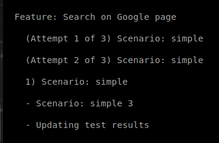
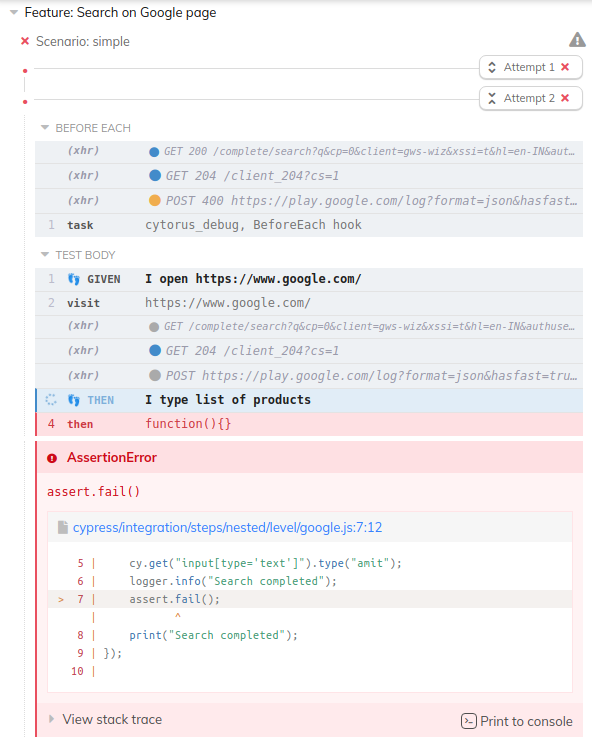

# Features

## Miscellaneous Features

### Retries

To automatically retry when a scenario can fail;

```gherkin
#> retries: 2
Scenario: This is a scenario
    Given I access a site on slow network
    Then it opens
```


