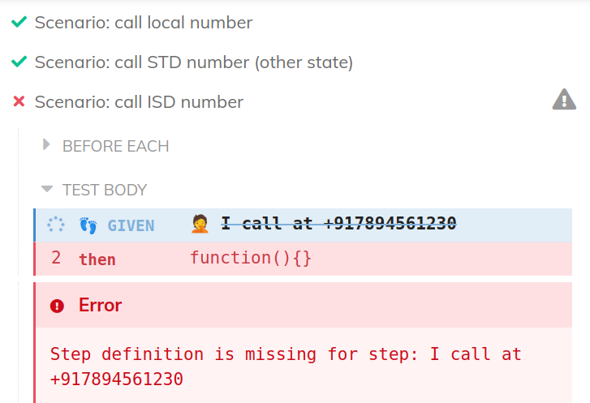
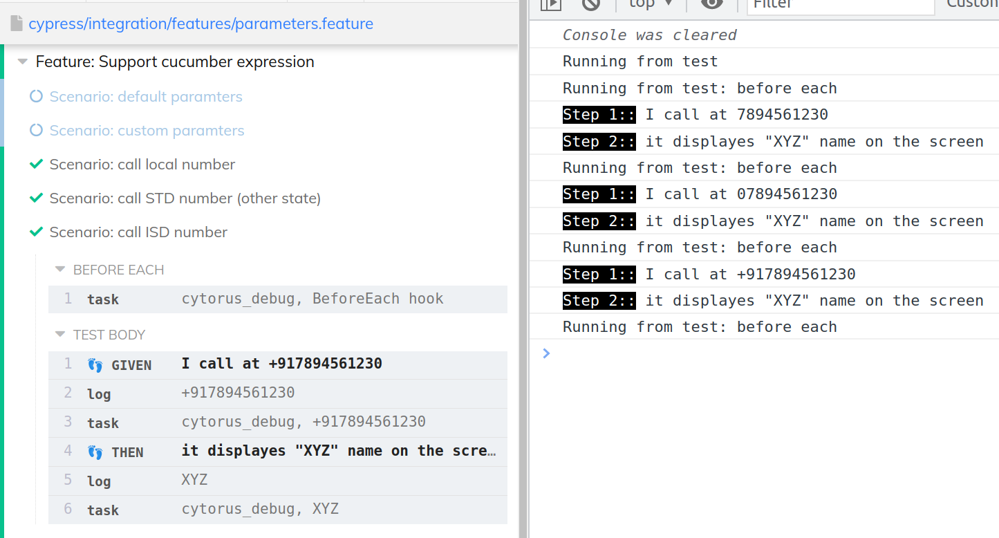

From v0.3.0 onwards;

You must have used `{int}` to match a step definition with dynamic number. Or `{string}` to match dynamic string value. 

Eg expression `I call at {int}` can be used to match some mobile number formats




To match all formats of mobile number, we can either use `I call at {string}` and change the last step to

```feature
Scenario: call ISD number
    Given I call at "+917894561230"
    Then it displayes "XYZ" name on the screen
```

Or we can create our own type which is more meaningful like following

```feature
@custom-mob
Scenario: call local number
    Given I call at 7894561230
    Then it displayes "XYZ" name on the screen

@custom-mob
Scenario: call STD number (other state)
    Given I call at 07894561230
    Then it displayes "XYZ" name on the screen

@custom-mob
Scenario: call ISD number
    Given I call at +917894561230
    Then it displayes "XYZ" name on the screen
```
Step definitions
```js
Then('I call at {mob}', (mob) => {
    //..
})

Then('it displayes {string} name on the screen', (name) => {
    //..
})
```

In this case, you'll have to declare a new type. For this, 
1. Create a folder in `cypress/integration` with name of your choise like "type" or "support" etc.
2. Define a type in following way

```js
import { defineParameterType } from 'cytorus/src/Globals'

defineParameterType({
  name: 'mob',
  regexp: /(?:\+91)?[0-9]{10}/,
  transformer (s) {
    return s
  }
})
```
3. Run tests

