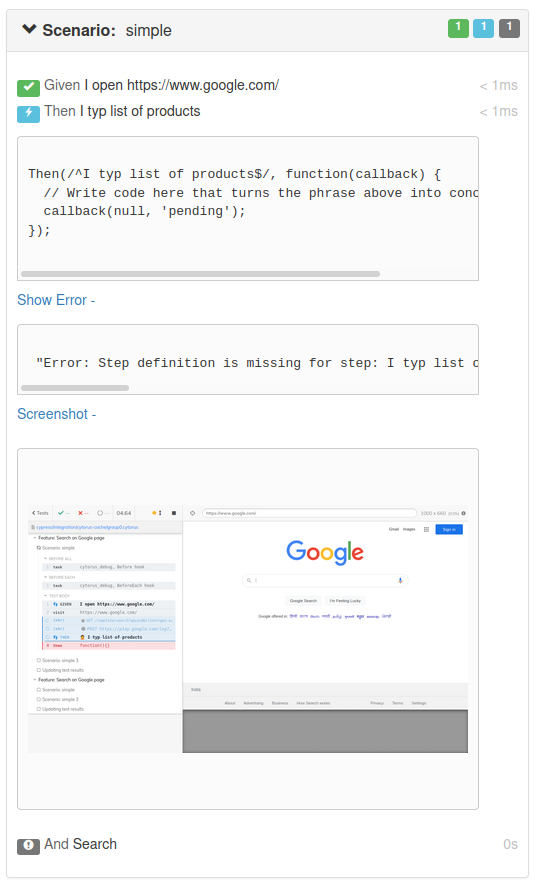

Cytorus generates detail and minimal reports in `.cytorus/result` folder. These reports can be used by to analyze result, or to generate reports.

You can install [cytorus-reporter](https://github.com/NaturalIntelligence/cytorus-reporter/) npm package to generate cucumber, cucumon, or other useful reports.

Check [cytorus-boilerplate](https://github.com/NaturalIntelligence/cytorus-boilerplate) for the configuration.

## Screenshots

Cytorus saves the path of screenshot for failing steps (including steps definition not found) in `step.screenshot` which can be used by a reporting plugin to embed it in reports.

[cytorus-reporter](https://github.com/NaturalIntelligence/cytorus-reporter/) embed the screenshot if relevant properties are set.

[> Next : Miscellaneous ](./10.Miscellaneous.md)