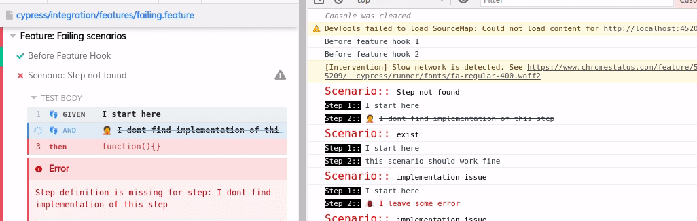

## Dashboard

You can see all the steps with 👣 in commands logs panel. Press F12 for console logs. When you clicks on particular step in command panel, it shows the line number in feature file, registered step definition, and argumnets passed to the step definition function.

## Summary report

Cytorus generates temprory detail and minimal reports in `.cytorus/result` folder. These reports can be used by to analyze result, or to generate reports. The out put of minimal reports look as follow;

You can install `cytorus-reporter` npm package to generate cucumber, cucumon, or other useful reports.